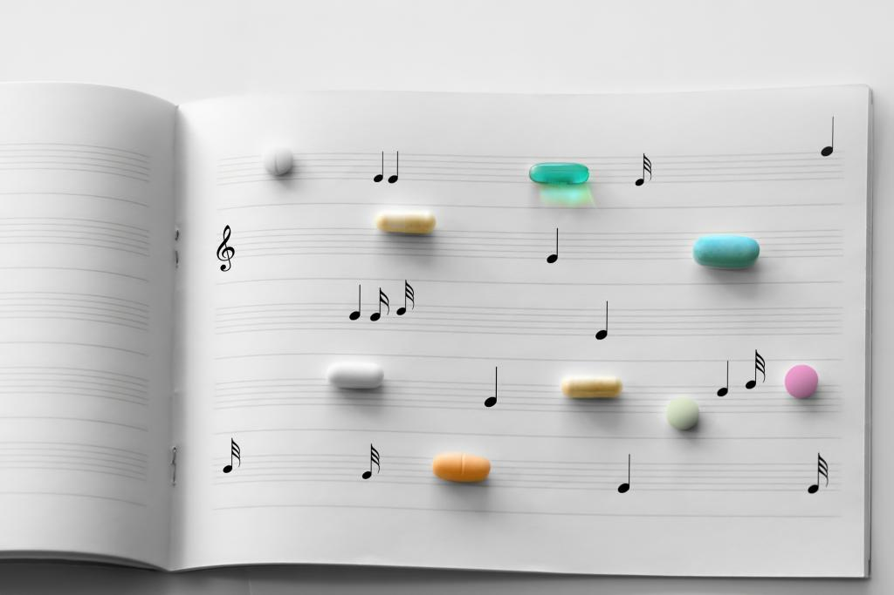

&nbsp;

 Image source: [Medical Daily](https://www.medicaldaily.com/)

&nbsp;

# About the Project
Illicit drug use is a major public health issue in United States. Previous studies showed a relationship between illicit drug use and pop music [1][2], indicating that pop music may have a potential encouraging effect on illicit drug use [3]. However, these studies are either cross-sectional, or need to be reproduce using more recent data.

The intended final products will describe the trend of music genre, frequency of illicit drug in the popular music, and the relationship between popular music and illicit drug use.

&nbsp;

# Website Overview
Data for this project includes two components: the Popular Music Data and the Illicit Drug Use Data. 
The Popular Music Data acquired from [Data on Songs from Billboard 1999-2019](https://www.kaggle.com/danield2255/data-on-songs-from-billboard-19992019). The dataset contains the time of release, music genre, peak rank, and lyrics.
The Illicit Drug Use Data acquired from [National Survey on Drug Use and Health (NSDUH) 1999-2019](https://www.datafiles.samhsa.gov/dataset/national-survey-drug-use-and-health-2019-nsduh-2019-ds0001). The dataset is for state-level small area estimates (SAEs), associated confidence intervals, and other key statistics related to state-level, model-based estimates of certain key substance use and mental health outcomes.

In the Exploratory analyses Part-1 tab, you will find:
<ul>
<li>Analysis of the popular music trend from 1999 to 2019, as well as the trend of substance use during this period at national level </li>
</ul>
In the Exploratory analysis Part-2 tab, you will find:
<ul>
<li>Analysis of the relationship between substance use and the trend of substance description in the lyric  </li>
</ul>

In the Regression Analyses tab, you will find:
<ul>
<li>Logistic analyses ;</li>
<li>XXX models investigating associations between income at the county-level and number of protests per county.</li>
</ul>

In the Interactive Maps tab, you will find:
<ul>
<li>A dashboard which includes a box plot, a line chart and an interactive geographical map that users can explore the trend of substance use in every states during the period of 1999 to 2019.</li>
</ul>

&nbsp;

# Additional Information
1. Visit the [Project Report](proj_report.html) tab in the upper right of the website for a full page write-up on what was done from start to finish in this project
2. Visit our project Youtube video, linked in the upper right corner of the website, for a brief introduction and overview of the project.

&nbsp;

# Refernece
<li>[1] Music festivals and drugs: Wastewater analysis
(https://pubmed.ncbi.nlm.nih.gov/30599351/)</li>
<li>[2] Booze, Drugs, and Pop Music: Trends in Substance Portrayals in the Billboard Top 100
(https://www.tandfonline.com/doi/full/10.3109/10826084.2012.637433/)</li>
<li>[3] Content analysis of tobacco, alcohol, and other drugs in popular music
(https://pubmed.ncbi.nlm.nih.gov/18250243/)</li>

&nbsp;

# Team members
<ul>
<li>[Ling Guo](https://Ling707_p8105hw4_github.io/)</li>
<li>[Mingkuan Xu](https://Mingkuanxu.github.io)</li>
<li>[Shibei Xu](https://shibeixxu.github.io/ShibeiXu.github.io/)</li>
<li>[Wenyi Liu](http://emily417417.github.io/)</li>
</ul>
